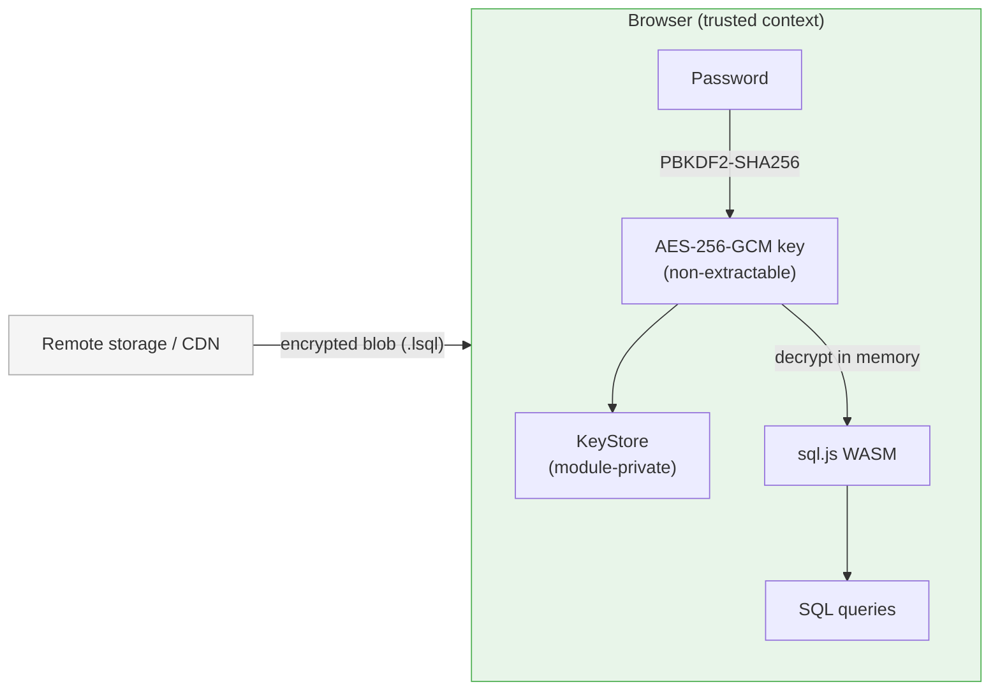

# libreSQL

**Browser-based E2EE SQLite database for end-to-end encrypted SaaS applications.**

libreSQL lets you load, query, and persist AES-256-GCM encrypted SQLite databases entirely inside the browser. The plaintext SQL data **never leaves the browser context** — only the encrypted blob is transmitted or stored, so your backend never sees the raw data.

---

## How it works



Only the **encrypted blob** crosses the network. The key and plaintext SQL data never leave the browser.

---

## Installation

```bash
npm install libresql sql.js
```

---

## Quick start

### Open an encrypted database

```ts
import { LibreSQL, KeyStore, deriveKey } from 'libresql';

// Derive the key once at login (store the salt in the user's profile on the server)
const key = await deriveKey(password, storedSalt);
KeyStore.set('main', key);

// Load and decrypt — entirely in the browser
const db = await LibreSQL.fromURL('https://cdn.example.com/files.lsql', {
  key: KeyStore.get('main')!,
});

// Query — reads do not trigger onWrite
const [result] = db.exec(
  "SELECT id, name FROM files WHERE name LIKE ? ORDER BY name",
  ['%.pdf'],
);

db.close(); // frees WASM memory
```

### Open from a file picker

```ts
input.addEventListener('change', async () => {
  const [file] = input.files;
  const db = await LibreSQL.fromFile(file, { key: KeyStore.get('main')! });
  // query as normal …
  db.close();
});
```

### Create a database and push it on every write

Extend `LibreSQL` and override `onWrite()` to react automatically to every
write operation:

```ts
import { LibreSQL, KeyStore } from 'libresql';

class CloudDB extends LibreSQL {
  protected override onWrite(): void {
    void this.encrypt().then(blob =>
      fetch('/api/db', { method: 'PUT', body: blob })
    );
  }
}

const db = await CloudDB.create({ key: KeyStore.get('main')! });
db.run('CREATE TABLE files (id INTEGER PRIMARY KEY, name TEXT, size INTEGER)');
// ^ onWrite() fires automatically — the encrypted blob is pushed to the server
```

### Migrate an existing SQLite database

```ts
const raw = await fetch('/legacy/app.sqlite').then(r => r.arrayBuffer());
const db  = await LibreSQL.fromPlainBuffer(raw, { key: KeyStore.get('main')! });

// Encrypt and push — server only ever receives ciphertext from now on
const blob = await db.encrypt();
await fetch('/api/db', { method: 'PUT', body: blob });
db.close();
```

---

## Multi-client consistency

When the same application is open on multiple devices (e.g. phone and laptop)
you need a strategy for keeping copies in sync.

### Push-on-write

The recommended default: re-encrypt and upload after every write.  Extend
`LibreSQL` with an `onWrite()` override as shown above.  Because each
encryption uses a fresh random IV and salt, the server sees a different
ciphertext every time and can use its blob hash as a write sequence number.

### Version comparison with `db.digest()`

Check whether a sync is needed without downloading the full blob:

```ts
// Server exposes a lightweight hash of the current plaintext content
const localDigest  = await db.digest();
const remoteDigest = await fetch('/api/db.sha256').then(r => r.text());

if (localDigest !== remoteDigest) {
  // Remote has newer data — fetch, decrypt, and reload
  const db2 = await LibreSQL.fromURL('/api/db.lsql', { key: KeyStore.get('main')! });
}
```

`digest()` hashes the raw SQLite bytes — two database instances with the same
data always produce the same digest, regardless of when they were encrypted.

### Key rotation

Replace the key stored in the instance without re-opening the database:

```ts
const newKey = await generateKey();
db.rotateKey(newKey);
KeyStore.set('main', newKey);

// Next encrypt() call uses the new key automatically
const blob = await db.encrypt();
await fetch('/api/db', { method: 'PUT', body: blob });
```

### Durability with a Service Worker

Use a Service Worker to keep the latest encrypted blob alive across accidental
tab closures.  The key is **never** sent to the SW.

**`sw.js`**

```ts
import { ServiceWorkerStorage } from 'libresql/sw';

const storage = new ServiceWorkerStorage();
self.addEventListener('message', (e) => storage.handleMessage(e));
```

**`app.ts`**

```ts
import { LibreSQL, KeyStore } from 'libresql';
import { saveToServiceWorker, loadFromServiceWorker } from 'libresql/sw';

// On startup — restore from SW cache or fetch from server
const cached = await loadFromServiceWorker();
const db = cached
  ? await LibreSQL.fromBuffer(cached, { key: KeyStore.get('main')! })
  : await LibreSQL.fromURL('/api/db.lsql', { key: KeyStore.get('main')! });

// Save to SW before unload
window.addEventListener('beforeunload', () => {
  void db.encrypt().then(saveToServiceWorker);
});
```

> **Advanced pattern:** The database can live entirely inside the Service
> Worker (shared across all tabs), with tabs sending SQL messages via
> `postMessage` and the SW executing queries and pushing results back.
> This eliminates per-tab copies and is ideal for high-concurrency
> applications.  Use a `BroadcastChannel` or SW `fetch` interception for
> a clean API boundary.

### Compression

`db.encrypt()` compresses the SQLite bytes with DEFLATE-raw and runs `VACUUM`
by default, keeping the blob as small as possible:

```ts
// Default: compress=true, vacuum=true
const blob = await db.encrypt();

// Opt out of compression for latency-sensitive writes
const blobFast = await db.encrypt({ compress: false, vacuum: false });
```

---

## API reference

### `LibreSQL` class

#### Open an encrypted database

| Method | Description |
|--------|-------------|
| `LibreSQL.fromURL(url, options, init?)` | Fetch an encrypted blob from a URL and open it. |
| `LibreSQL.fromFile(file, options)` | Open an encrypted `File` (from `<input type="file">`). |
| `LibreSQL.fromBuffer(buffer, options)` | Open an encrypted `ArrayBuffer` or `Uint8Array`. |

`options` accepts `{ password: string }` or `{ key: CryptoKey }`.  The
resolved key is stored in the instance automatically.

#### Create a new database

| Method | Description |
|--------|-------------|
| `LibreSQL.create(options)` | Create a new, empty in-memory SQLite database. |
| `LibreSQL.fromPlainBuffer(buffer, options)` | Open a raw (unencrypted) SQLite file for migration. |

`options` requires a `key: CryptoKey`.

#### Read

| Method | Description |
|--------|-------------|
| `db.exec(sql, params?)` | Execute SQL, returns `QueryResult[]`. |

#### Write

| Method | Description |
|--------|-------------|
| `db.run(sql, params?)` | Execute a data-modification statement; triggers `onWrite()`. Returns `this`. |
| `db.onWrite()` _(protected)_ | Override in a subclass to react to writes (push-on-write pattern). |

#### Persistence

| Method | Description |
|--------|-------------|
| `db.encrypt(options?)` | Encrypt the database (VACUUM + compress by default) and return a `Uint8Array`. |
| `db.digest()` | SHA-256 hex of the current database content — stable across instances with the same data. |

#### Key management

| Method / Property | Description |
|-------------------|-------------|
| `db.key` | The `CryptoKey` stored in this instance (non-extractable). |
| `db.rotateKey(newKey)` | Replace the stored key; takes effect on the next `encrypt()` call. |

#### Lifecycle

| Method | Description |
|--------|-------------|
| `db.close()` | Close the database and free WASM memory. |

---

## Security

### Cryptographic design

| Property | Mechanism |
|----------|-----------|
| Confidentiality | AES-256-GCM — IND-CCA2 secure |
| Integrity / authenticity | AES-GCM 128-bit authentication tag — tamper detection built-in |
| Key derivation | PBKDF2-SHA256, 600 000 iterations — ≥ 2× the 2025 OWASP minimum of 310 000 |
| Random values | `crypto.getRandomValues` — cryptographically secure |
| Key isolation | Non-extractable `CryptoKey` objects — raw bytes never accessible to JavaScript |
| Session key storage | `KeyStore` is module-private — not in cookies, storage APIs, or globals |
| Data residency | SQLite bytes exist only in WASM memory — never serialised to the network in plaintext |

The design follows the client-side-encrypt-before-upload pattern used by
[Proton](https://proton.me/security) and [Ente](https://ente.io/blog/e2ee/).

### Storing the key securely

Never put the user's key in `localStorage`, `sessionStorage`, or a cookie:

| Storage | Problem |
|---------|---------|
| `localStorage` / `sessionStorage` | Accessible by any same-origin script; serialised as plain text |
| `document.cookie` | Transmitted with every HTTP request to the origin |
| Custom window/global property | Readable by any same-origin script |

`KeyStore` keeps `CryptoKey` objects in a **module-private `Map`**.  Because
the keys are non-extractable, raw bytes can never be read or serialised:

```ts
import { KeyStore, deriveKey } from 'libresql';

// — Login —
const salt = /* load from server or user profile */;
const key  = await deriveKey(userPassword, salt);  // non-extractable
KeyStore.set('main', key);

// — Per-operation usage —
const db = await LibreSQL.fromURL(url, { key: KeyStore.get('main')! });

// — Logout —
KeyStore.delete('main');  // or KeyStore.clear() to wipe everything
```

The key lives only for the current tab's lifetime.  On a hard reload the user
re-authenticates — which is the correct E2EE behaviour.

### Password-based vs key-based workflow

When you open a database with a **password**, libreSQL derives the
AES-256-GCM key from the PBKDF2 salt embedded in the blob header and stores
it in the instance.  Subsequent `encrypt()` calls use the stored key directly
(no PBKDF2 re-derivation).  To decrypt the resulting blob, the same key is
required.

The **recommended workflow** is therefore:

1. Derive the key once per session: `const key = await deriveKey(pw, storedSalt)`
2. Store it: `KeyStore.set('main', key)`
3. Open the database: `LibreSQL.fromURL(url, { key })`
4. All subsequent operations use the stored key — no password re-entry needed

Store the **salt** (not the password) server-side in the user's profile.  The
salt is not secret and is needed to re-derive the same key from the same
password on the next session.

---

## Browser compatibility

libreSQL uses only [Baseline](https://web.dev/baseline) widely available APIs:
- **Web Crypto API** (`crypto.subtle`) — key derivation, AES-GCM
- **WebAssembly** — sql.js (SQLite in the browser)
- **`CompressionStream` / `DecompressionStream`** — DEFLATE-raw compression (used in `encrypt()`)
- **`fetch`** — for `fromURL()`

---

## Encrypted file format

| Offset | Size | Description |
|--------|------|-------------|
| 0 | 4 B | Magic bytes `LSQL` |
| 4 | 1 B | File format version (`0x01`) |
| 5 | 1 B | KDF identifier (`0x00` = PBKDF2-SHA256) |
| 6 | 4 B | PBKDF2 iteration count (big-endian uint32) |
| 10 | 1 B | Flags (bit 0 = `FLAG_COMPRESSED`) |
| 11 | 32 B | PBKDF2 salt (random, unique per encryption) |
| 43 | 12 B | AES-GCM nonce / IV (random, unique per encryption) |
| 55 | … | AES-GCM ciphertext (optionally DEFLATE-raw compressed plaintext + 16-byte auth tag) |
