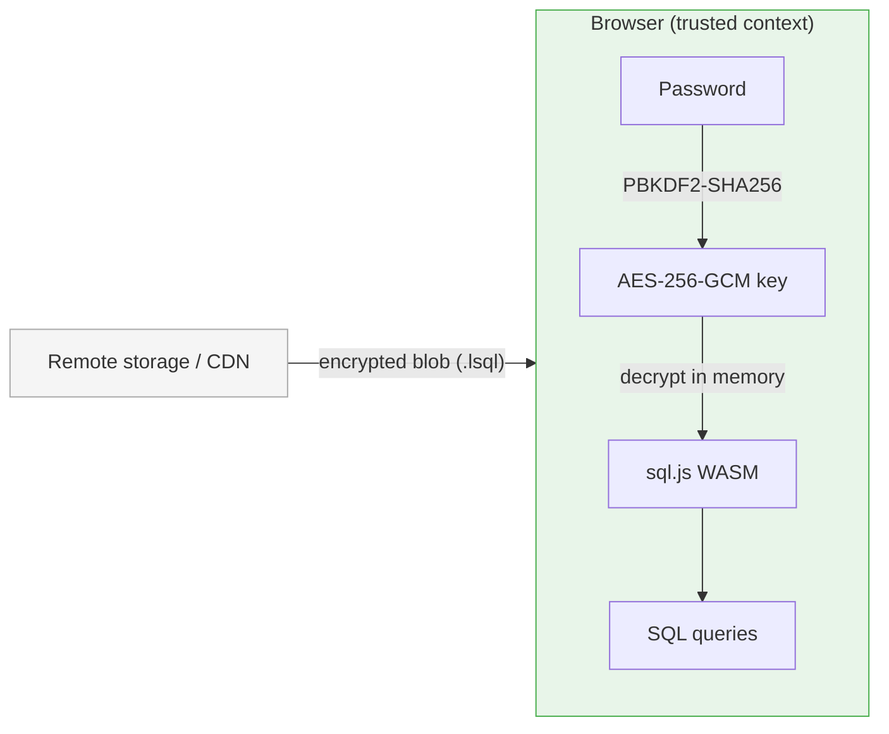

# libreSQL

**Browser-based E2EE SQLite database for end-to-end encrypted SaaS applications.**

libreSQL lets you load, query, and persist AES-256-GCM encrypted SQLite databases entirely inside the browser. The plaintext SQL data **never leaves the browser context** — only the encrypted blob is transmitted or stored, so your backend never sees the raw data.

---

## How it works



Only the **encrypted blob** crosses the network. The key and plaintext SQL data never leave the browser.

---

## Installation

```bash
npm install libresql
```

---

## Quick start

### Load an encrypted database from a URL

```ts
import { LibreSQL, KeyStore, deriveKey } from 'libresql';

// Derive the key once at login and keep it in the secure session store
const key = await deriveKey(password, salt);
KeyStore.set('main', key);

// Load and decrypt — entirely in the browser
const db = await LibreSQL.fromURL('https://cdn.example.com/files.lsql', {
  key: KeyStore.get('main')!,
});

// Full-text-style search on file metadata
const [result] = db.exec(
  "SELECT id, name FROM files WHERE name LIKE ? ORDER BY name",
  ['%.pdf'],
);

for (const [id, name] of result.values) {
  console.log(id, name);
}

db.close(); // frees WASM memory
```

### Load from a `<input type="file">` picker

```ts
input.addEventListener('change', async () => {
  const [file] = input.files;
  const db = await LibreSQL.fromFile(file, { key: KeyStore.get('main')! });
  // query as normal …
  db.close();
});
```

### Create a database and encrypt it for upload

```ts
import { LibreSQL, KeyStore } from 'libresql';

const db = await LibreSQL.create();
db.run('CREATE TABLE files (id INTEGER PRIMARY KEY, name TEXT, size INTEGER)');
db.run('INSERT INTO files VALUES (?, ?, ?)', [1, 'report.pdf', 4096]);

// Encrypt and upload — the server only ever receives ciphertext
const encrypted = await db.encrypt({ key: KeyStore.get('main')! });
await fetch('/api/db', { method: 'PUT', body: encrypted });

db.close();
```

---

## Secure key storage

Never put the user's key in `localStorage`, `sessionStorage`, or a cookie.
Those are accessible to other scripts or transmitted to the server.

libreSQL ships a `KeyStore` that keeps **non-extractable `CryptoKey` objects
in module-private memory** — they cannot be read or serialised by any script
and are never sent over the network.

```ts
import { KeyStore, deriveKey } from 'libresql';

// — Login —
const salt = /* load from your server or user profile */;
const key  = await deriveKey(userPassword, salt);   // non-extractable
KeyStore.set('main', key);                          // in-memory only

// — Per-operation usage —
const db = await LibreSQL.fromURL(url, { key: KeyStore.get('main')! });

// — Logout —
KeyStore.delete('main');   // or KeyStore.clear() to wipe everything
```

The key lives only for the current tab/page lifetime.  On a hard reload the
user must re-authenticate — which is the correct E2EE behaviour.

---

## Multi-client consistency

When the same user has the application open on multiple devices (e.g. phone
and laptop), you need a strategy for keeping the local and remote copies in sync.

### Push-on-write

The simplest safe model is **push-on-write**: every time a write transaction
completes, re-encrypt and upload the whole database.

```ts
async function saveDatabase(db: LibreSQL, key: CryptoKey, url: string) {
  const blob = await db.encrypt({ key });
  await fetch(url, { method: 'PUT', body: blob });
}
```

Because each encryption uses a fresh random IV and salt, the server can
compare ETags or SHA-256 hashes to detect concurrent writes without reading
the plaintext.

### Version comparison with `digestBlob`

Avoid downloading the whole database just to check whether it changed.
Instead, let the server expose a lightweight hash endpoint and compare it
against the blob you already hold locally:

```ts
import { LibreSQL } from 'libresql';

// Check whether the remote copy is newer — no full download needed
const localDigest  = await LibreSQL.digestBlob(localEncryptedBlob);
const remoteDigest = await fetch('/api/db.lsql.sha256').then(r => r.text());

if (localDigest !== remoteDigest) {
  // Remote is newer — fetch, decrypt, and reload
  const db = await LibreSQL.fromURL('/api/db.lsql', { key });
}
```

The server computes `SHA-256(encrypted_blob)` and serves it as a tiny text
file alongside the database. This is cheap to compare and requires no
knowledge of the plaintext.

### Durability with a Service Worker

A Service Worker can keep the in-memory database alive across accidental tab
closures by holding a reference to the encrypted blob in its module scope:

```ts
// sw.js
let latestBlob: ArrayBuffer | null = null;

self.addEventListener('message', (event) => {
  if (event.data.type === 'SAVE_DB') {
    // The page sends the encrypted blob; the SW caches it in memory
    latestBlob = event.data.payload;
  }
  if (event.data.type === 'LOAD_DB') {
    event.source?.postMessage({ type: 'DB_BLOB', payload: latestBlob });
  }
});
```

```ts
// app.ts — persist before unload
window.addEventListener('beforeunload', async () => {
  const blob = await db.encrypt({ key: KeyStore.get('main')! });
  navigator.serviceWorker.controller?.postMessage(
    { type: 'SAVE_DB', payload: blob.buffer },
    [blob.buffer],        // transfer, not copy
  );
});
```

The key is **never** sent to the Service Worker — only the encrypted blob.
When the tab reopens, it fetches the blob from the SW and decrypts it locally
with the key re-derived from the user's password.

### Compression

For large databases you can shrink the transfer size using the Baseline
[`CompressionStream` API](https://developer.mozilla.org/en-US/docs/Web/API/CompressionStream)
**before** encryption:

```ts
async function compress(data: Uint8Array): Promise<Uint8Array> {
  const cs = new CompressionStream('gzip');
  const writer = cs.writable.getWriter();
  writer.write(data);
  writer.close();
  return new Uint8Array(await new Response(cs.readable).arrayBuffer());
}

// Compress the raw SQLite bytes, then encrypt
const compressed = await compress(db.export());
const blob = await encryptData(compressed, { key });
```

---

## API reference

### `LibreSQL` class

#### Factory methods (open encrypted)

| Method | Description |
|--------|-------------|
| `LibreSQL.fromURL(url, options, init?)` | Fetch an encrypted blob from a URL and open it. |
| `LibreSQL.fromFile(file, options)` | Open an encrypted `File` (e.g. from `<input type="file">`). |
| `LibreSQL.fromBuffer(buffer, options)` | Open an encrypted `ArrayBuffer` or `Uint8Array`. |

All `options` accept either `{ password: string }` or `{ key: CryptoKey }`.

#### Factory methods (plaintext / bootstrapping)

| Method | Description |
|--------|-------------|
| `LibreSQL.create(options?)` | Create a new, empty in-memory SQLite database. |
| `LibreSQL.fromPlainBuffer(buffer, options?)` | Open a raw (unencrypted) SQLite file. |

#### Instance methods

| Method | Description |
|--------|-------------|
| `db.exec(sql, params?)` | Execute SQL, returns `QueryResult[]`. |
| `db.run(sql, params?)` | Execute a data-modification statement (returns `this` for chaining). |
| `db.export()` | Export as raw (unencrypted) SQLite `Uint8Array`. |
| `db.encrypt(options)` | Export as an encrypted LibreSQL `Uint8Array`. |
| `db.close()` | Close the database and free WASM memory. |

#### Static utilities

| Method | Description |
|--------|-------------|
| `LibreSQL.digestBlob(blob)` | SHA-256 hex digest of an encrypted blob (for version comparison). |

### `KeyStore`

In-memory session store for non-extractable `CryptoKey` objects.

| Method / Property | Description |
|-------------------|-------------|
| `KeyStore.set(id, key)` | Store a key under `id`. |
| `KeyStore.get(id)` | Retrieve a key, or `undefined`. |
| `KeyStore.has(id)` | Returns `true` if a key exists for `id`. |
| `KeyStore.delete(id)` | Remove the key for `id`. |
| `KeyStore.clear()` | Remove all keys (call on logout). |
| `KeyStore.size` | Number of keys currently held. |

### Crypto helpers

```ts
import {
  deriveKey,    // PBKDF2-SHA256 key derivation
  generateKey,  // random AES-256-GCM key
  importRawKey, // import 32 raw bytes as a CryptoKey
  encryptData,  // encrypt arbitrary bytes → LibreSQL blob
  decryptData,  // decrypt a LibreSQL blob → plaintext bytes
} from 'libresql';
```

---

## Security design

| Property | Mechanism |
|----------|-----------|
| Confidentiality | AES-256-GCM — IND-CCA2 secure |
| Integrity / authenticity | AES-GCM 128-bit authentication tag (tamper detection) |
| Key derivation | PBKDF2-SHA256, 600 000 iterations (≥ 2× the 2025 OWASP minimum of 310 000) |
| Random values | `crypto.getRandomValues` — cryptographically secure |
| Key isolation | Non-extractable `CryptoKey` objects; raw bytes never accessible to JS |
| Session key storage | Module-private `KeyStore` — not in cookies, storage APIs, or globals |
| Data residency | SQLite bytes exist only in WASM memory; never serialised to the network |

The design is inspired by the approaches used by [Proton](https://proton.me/security) and [Ente](https://ente.io/blog/e2ee/): encrypt data client-side before it leaves the device, with keys derived from user-owned secrets.

---

## Browser compatibility

libreSQL uses only [Baseline](https://web.dev/baseline) widely available APIs:
- **Web Crypto API** (`crypto.subtle`)
- **WebAssembly**
- **`CompressionStream`** (optional, for the compression pattern above)

---

## Encrypted file format

| Offset | Size | Description |
|--------|------|-------------|
| 0 | 4 B | Magic bytes `LSQL` |
| 4 | 1 B | File format version (`0x01`) |
| 5 | 1 B | KDF identifier (`0x00` = PBKDF2-SHA256) |
| 6 | 4 B | PBKDF2 iteration count (big-endian uint32) |
| 10 | 32 B | PBKDF2 salt (random, unique per encryption) |
| 42 | 12 B | AES-GCM nonce / IV (random, unique per encryption) |
| 54 | … | AES-GCM ciphertext (SQLite bytes + 16-byte auth tag) |

---

## License

BSD 2-Clause © Johannes Maron
